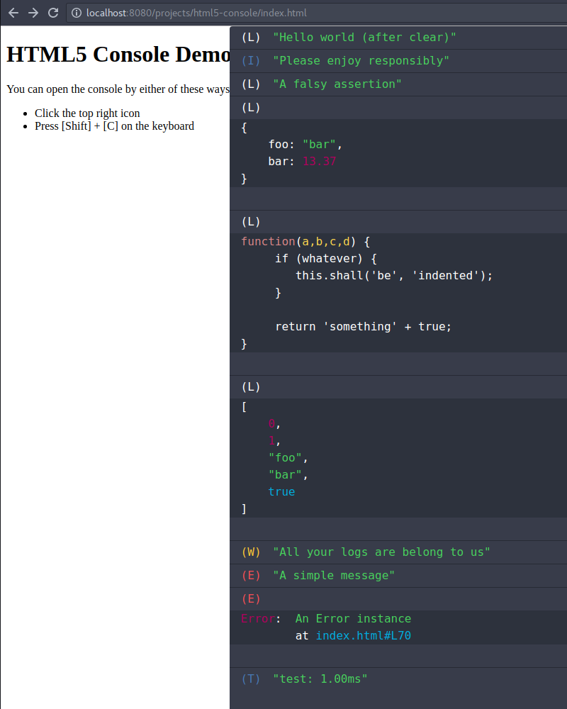

# HTML5 console

This is a minimalistic console that allows using the
[Console API](https://developer.mozilla.org/en-US/docs/Web/API/console)
inside Browsers or Runtimes that don't ship with a 
proper console.

Don't want to deal with Safari or WebKit Mobile and
its debugging pipeline of > 4GB+? Then worry no more,
the HTML5 console is a simple JS file that you can
embed like so (make sure it's inside `<head>` !!!).

```html
<!DOCTYPE html>
<html>
<head>
	<script src="./path/to/build/console.min.js">
</head>
<body>
	<script>
	console.log('Hello world');
	console.warn(function(a,b,c) {
		return 'this is fun!';
	});
	</script>
</body>
```

## User Interface

The User Interface allows easy debugging and has neat
integrations like filters and watchers:




## Bookmarklet Awesomeness

Instructions TBD


## Official API / Features

- `console.assert(condition)`
- `console.clear()`
- `console.log(...arguments)`
- `console.info(...arguments)`
- `console.warn(...arguments)`
- `console.error(...arguments)`
- `console.group(name)`
- `console.groupEnd(name)`
- `console.trace()`


## Unsupported API / Not Yet Implemented

- `console.count()`
- `console.debug()`
- `console.dir()`
- `console.dirxml()`
- `console.exception()`
- `console.groupCollapsed()`
- `console.profile()`
- `console.profileEnd()`
- `console.table()`
- `console.time()`
- `console.timeEnd()`
- `console.timeStamp()`

